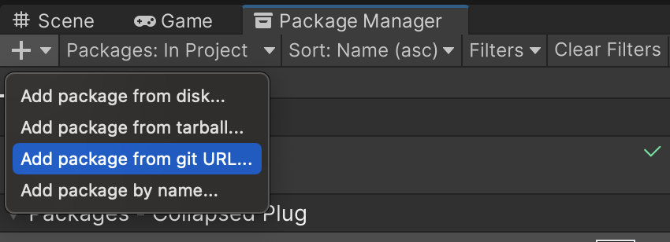

# ClpsPLUG's Pooled Objects for Unity

Yet another way to pool objects to reduce performance overhead in Unity.

## Installation

Use UPM - select "Add package from Git URL" and paste the following:

```
https://github.com/Clpsplug/PooledObjects.git
```



## Basic concept

This library enables you to create what's known as 'memory pool',
but in a form of a pool of (mainly) GameObjects.

In short, when you create a memory pool using this library,
you will do the following.

1. You initialize a batch of instances of a prefab, but inactive.
2. You call one of the instance for usage (spawn), and get the instance.
3. You do anything you want with that instance. Run animation, change color, anything.
4. After usage, you put away the instance (despawn). Or the instance itself can decide to put itself away.
5. Rinse and repeat 2 ~ 4.

In this way, you will reduce the overhead of spawning instances of certain prefabs
(especially in a large number), leading to better performance.

## How to use

You will need the following:

* Your custom MonoBehaviour script implementing `Clpsplug.PooledObjects.Runtime.IPoolable` interface
* A prefab of GameObject that has the aforementioned script attached
* An inherited class of `Clpsplug.PooledObjects.Runtime.PooledObjects<T>` (or the abstract class with different generic
  typeparam count but the same name)
* A prefan instantiation code.

### The script to be pooled

First, prepare your MonoBehaviour script for our PooledObjects system.

```csharp
using UnityEngine;
using Clpsplug.PooledObjects.Runtime;
public class PooledMonoBehaviour: MonoBehaviour, IPoolable
{
    public bool isUsed {get; private set;}
    
    private void Awake()
    {
        isUsed = false;
        gameObject.SetActive(false);
    }
    
    public void OnSpawn()
    {
        /* Spawned! */
        gameObject.SetActive(true);
        isUsed = true;
    }
    
    public void OnDespawn()
    {
        gameObject.SetActive(false);
        isUsed = false;
    }
}
```

Here, we have three method - one of which is the unity event function, `Awake`.
We immediately set the GameObject inactive, hiding it from view - but it's still in the scene,
so it doesn't get 'instantiated' in a traditional sense anymore;
rather, it is 'spawned'.  
Look at the `OnSpawn` method - it activates the GameObject, and sets the property `isUsed` to `true`;
this property is from the interface `IPoolable`.
It is required to signal which instance is currently used and which is not.  
And in the `OnDespawn` method, we hide the GameObject again and set the `isUsed` property to `false`,
effectively returning itself to whatever pool it's controlled in.

### The Pool

Now, we make the pool - we determine what GameObject a particular pool manages by its generic type parameter, like so:

```csharp
using Clpsplug.PooledObjects.Runtime;
public class MonoBehaviourPool: PooledObjects<PooledMonoBehaviour>
{
    public override void OnSpawn(PooledMonoBehaviour item)
    {
        item.OnSpawn();
    }
    public override void OnDespawn(PooledMonoBehaviour item)
    {
        item.OnDespawn();
    }    
}
```

The implementation of the pool itself is fairly simple - the overridable methods `OnSpawn` and `OnDespawn`
is automatically called with the item being spawned/despawned, so you call whatever method you want on it.

> [!WARNING]  
> One thing you *don't* want to do is to call `Destroy(item.gameObject)` in `OnDespawn`; it's gonna break the pool!  
> When we say despawn, it means that the gameObject in question simply gets inactive, but still in the scene.
> Destroying it when we want to despawn it causes a null reference exceptions later down the line.

### Use the pool

Time to use the pool. Simply create an instance of a pool, and do this:

```csharp
public GameObject pooledInstancePrefab;
MonoBehaviourPool pool = new MonoBehaviourPool();
pool.Initialize(
    () => Instantiate(pooledInstancePrefab).GetComponent<PooledMonoBehaviour>(),
    100 // how many instances we want to pool?
);
```

This will initialize the pool. When this happens, 100 instances of `pooledInstancePrefab` is created,
as dictated by the second parameter of the method `Initialize`.  
At this point, it appears that nothing is in the scene,
but if you see the inspector, you will notice inactive instances of the prefab.

Now when we call `Spawn` on the pool...

```csharp
var instance = pool.Spawn();
```

You obtain an instance that was sitting in the pool. When this happens, the pool's `OnSpawn` is called,
therefore, `PooledMonoBehaviour.OnSpawn()` is called.
Now you can do anything you want with this instance,
e.g., set its position, set parameters...

After you are done with the instance, you can call `Despawn()`, passing the instance as the parameter.

```csharp
pool.Despawn(instance);
```

This returns the instance to the pool. Similar to when we called `Spawn`,
the pool's `OnDespawn` is called, therefore, `PooledMonoBehaviour.OnDespawn()` gets called.

You can call `Spawn` as many times you want, until the pool is empty of ready-to-use instances,
in which case several things can happen.

## What happens when we exhaust the pool?

Short answer: it depends. Long answer: it's been determined when you called `Initialize` of the pool.

`Initialize` has an optional third argument that takes an enum `ExhaustionBehaviour`.
The member passed to this argument decides the behaviour when there are no instances to use.

| ExhaustionBehaviour | Behaviour when `Spawn()` is called but no free instances                           |
|:--------------------|:-----------------------------------------------------------------------------------|
| Throw (Default)     | Throws `PooledObjectsExhaustedException`.                                          |
| NullOrDefault       | Returns `null` or whatever default value.                                          |
| AddOne              | Creates exactly one new instance and returns that. The size of the pool increases. |
| Double              | Creates the same amount of the instance, effectively doubling the pool size.       |

Each behaviour comes with its own pros and cons - which to use depends on the nature of the object you're dealing with.

> [!NOTE]  
> Some keen readers might have realized we call the behaviour where `null` is returned `NullOrDefault`,
> not simply `ReturnNull` or something.  
> This is because this pool can be used for non-MonoBehaviour stuff, including structs and plain-old classes,
> so long as they implement `IPoolable`!  
> In fact, the pool-related code is free of UnityEngine dependencies, so it's possible to yank the classes out
> and implement for other projects!


## TODO

* More documentation
* Increase the type parameter variant of the pool base
* Performance?
